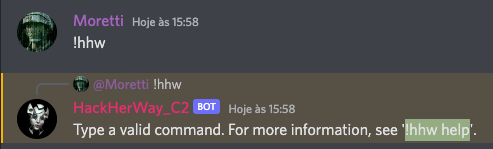

## A4 - Botnet Challenge

### O desafio
A ideia principal do desafio da Botnet é demonstrar o funcionamento de um servidor de Comando e Controle (C2) que utiliza a infraestrutura do **Discord** como meio de comunicação entre o servidor da Botnet (C2) e os hosts infectados (bots). Ao se "esconder" atrás da infraestrutura do Discord, fica mais complexo detectar o funcionamento da botnet na rede, uma vez que o tráfego de rede se juntará ao de um usuário legítimo da plataforma.

Na descrição do desafio, foi informado que o time de Threat Intelligence está monitorando a existência de uma possível botnet funcionando no Discord. O time identificou que os bots estão disponíveis em canais privados, e no caso em questão foram colocados na sala do Discord das candidatas. Foi informado que uma forma de interagir com a Botnet é através do uso do comando `!hhw` nos canais onde os bots se comunicam.

---

### Flag 1
A primeira flag é encontrada ao explorar o comando `!hhw` para interagir com a Botnet, possibilitando entender o 
funcionamento do servidor de C2. O comando `!hhw` é utilizado para administrar a botnet. Ao digitar o comando é apresentada a opção de obter ajuda sobre o uso do comando através da opção `!hhw help`.

Ao executar o comando, é apresentada uma mensagem informando a forma correta de utilizar o comando e mais algumas opções, dentre elas o comando `flag`.

Ao digitar `!hhw` flag no canal privado em que a botnet está operando, a candidata terá como resposta da Botnet uma sequência de caracteres `WVNIe0JlbXZpbmRhX2FvX0Rlc2FmaW9fWVNIX0JvdG5ldH0=`, conforme imagem abaixo.

Uma das formas mais comuns de codificar dados é através do uso de `base64`. Ao decodificar o resultado apresentado pelo comando anterior, é possível obter a flag `YSH{Bemvinda_ao_Desafio_YSH_Botnet}`.

---

### Flag 2 
A segunda flag é obtida através da análise do código-fonte que foi obtido pelo time de Threat Detection, através de atividades forense em uma máquina infectada com o cliente da botnet. Através do código-fonte é possível analisar como o bot recebe os comandos do servidor de C2 e a forma que ele lida com as chamadas na API do Discord. A flag solicitada nesta etapa do desafio é o código (ID) do servidor de C2 ao qual este bot se conecta, que é possível obter através da variável `C2_SERVER`, conforme demonstrado na imagem abaixo.

Como as flags seguem o padrão YSH{}, a flag para esta etapa do desafio será `YSH{1015236129190068305}`.
___

### Flag 3
A última flag do desafio consiste em descobrir qual o TOKEN utilizado pelo bot do Discord que faz o papel de servidor de C2, visto que através desse TOKEN seria possível fazer o **takeover** da Botnet. Esta etapa envolve entender como o servidor de C2 se comunica com os bots para envio de instruções, além de identificar como o TOKEN é utilizado no código e uma possível forma de obter essa informação.

Através da análise do código-fonte, é possível identificar que o TOKEN para execução do bot do Discord está sendo obtido através de uma variável de ambiente chamada `YSH_BOT_TOKEN`.

Também é possível verificar uma instrução de TODO no código-fonte, dando a entender a existência de um possível comando `exec` já implementado na C2 e que poderia ser reaproveitado no código do bot.

Analisando os comandos disponíveis no `!hhw`, é possível verificar a existência do `start`. Ao executar o comando `!hhw start, o servidor de C2 envia para os bots disponíveis as instruções que devem ser executadas.

É possível verificar na imagem anterior que o bot exibe uma mensagem com a instrução `exec env` como *payload*, que 
foi recebida das instruções do servidor de C2. É possível verificar as instruções ao decodificar os *payloads* que 
estão em **base64**.

Neste momento, de posse de todas as descobertas e inferências anteriores, é possível concluir que:
1. O servidor de C2 executa em ambiente linux (veja `!hhw info`);
2. Existe um comando `exec` implementado no servidor de C2;
3. O TOKEN é recuperado através de uma variável de ambiente;
4. Os payloads são enviados em **base64**.

Assim, a flag final pode ser obtida através da leitura da variável de ambiente `YSH_BOT_TOKEN` no ambiente Linux. A forma mais comum de obter as informações das variáveis de ambiente no linux é através do comando `env`.

Fazendo algumas tentativas no servidor de C2, é possível inferir que os comandos inexistentes retornam uma mensagem, porém para o comando `exec` isso não acontece, o que confirma a existência de uma possível implementação do mesmo.

O comando `!hhw exec env` não retornou nada ao ser executado. Lembre-se que os payloads são enviados em codificação **base64**.

Ao converter o _payload_ para **base64** e enviar o comando `!hhw exec ZW52` para o servidor de C2, é possível obter os dados das variáveis de ambiente da sessão que está sendo executada no servidor. Ao ler o conteúdo da variável `YSH_BOT_TOKEN`, é possível obter a última flag, que é `YSH{PARABENS_Controle_da_Botnet_com_o_TOKEN}`.

