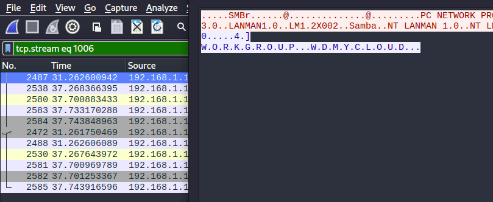
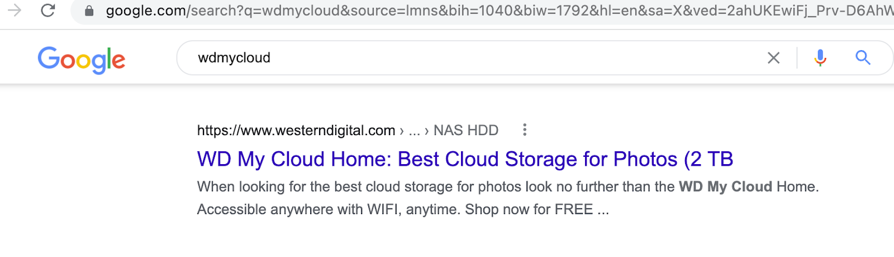

## D4 - PCAP Analysis Challenge

O texto comenta sobre vazamento de informações e busca por novos alvos. Basicamente podemos resolver o exercício todo utilizando a ferramenta Wireshark disponível para todas as plataformas.

Começar o exercício pegando estatística de quantos endereços IP existem nesse PCAP para entender o tamanho do problema.

`Statistics -> IPv4 Statistics -> All Addresses`


Visualmente vemos 3 endereços com uma contagem de pacotes maior.

```
192.168.1.113
192.168.1.110
192.168.1.103
```

Agora vamos ver as estatísticas por destino e portas

`Statistics -> IPv4 Statistics -> Destination and Ports`

Para cada um desses 3 endereços:

```### 192.168.1.113```


Temos muitas portas TCP com a contagem de 01 (UM)

`### 192.168.1.110`


Somente 2 portas, uma UDP e uma TCP.
```
UDP = 785
TCP = 31337
```

`### 192.168.1.103`


Várias portas TCP com contagens pequenas mas variáveis…

Voltando ao enunciado …

- D4.1 - Recupere as informações vazadas pelo protocolo TCP.
- D4.2 - Recupere as informações vazadas pelo protocolo UDP.
- D4.3 - Recupere as informações vazadas pelo protocolo ICMP.

No wireshark podemos fazer um filtro somente pelo protocolo ….

Vamos começar pelo ICMP:


Visualmente podemos identificar a maioria dos pacotes com tamanho (Lenght) de 98 e 3 pacotes com tamanho diferente. O primeiro com 60 que aparentemente não faz parte de nossa investigação e 2 pacotes com 176 de tamanho.

O protocolo ICMP é utilizado nas comunicações TCP/IP dentre outras coisas como sinalizador de erro, indicando quando um host ou porta não estão acessíveis. Não é utilizado para transportar dados como o TCP e o UDP. E é o protocolo do PING ( Echo Request e Echo Reply ).

Sabendo disso, se o criminoso está vazando informações e através do protocolo ICMP, o endereço IP origem, quem faz o 
Request (Echo Request) e o endereço IP destino, quem responde (Echo Reply)

Temos assim:
192.168.1.103 ( Origem )
192.168.1.110 ( Destino )


Clicando no pacote número 412 , vemos que o campo DATA contém 134 bytes e não os 48 bytes padrão.


Olhando no conteúdo desse campo, logo abaixo na parte HEXA/ASCII, temos ..


Flag ICMP encontrada para D4.3 - Recupere as informações vazadas pelo protocolo ICMP: `YSH{SecretsINdataPINGs}`

Se seguirmos a mesma lógica e somente mudarmos o filtro de ICMP para UDP …

Temos mais comunicação entre as maquinas 192.168.1.103 e 192.168.1.110


Diretamente no wireshark podemos ir em …

`Analyze -> Follow - > UDP Stream`


Na parte de baixo da tela, pode gravar esse arquivo na sua máquina e analisar, no exemplo foi gravado com o nome `file_udp`.


Usando o comando file do linux para identificar que tipo de arquivo é esse, temos:


Um arquivo do tipo `ASCII Text`  igual ao que vimos na tela do wireshark.

Analisando o arquivo/texto com calma, vemos que ele acaba com  == , uma dica de que esse arquivo pode ser um arquivo convertido para BASE64 .


Sendo assim, temos que transformar o arquivo gravado de volta em seu formato original .


O parâmetro  `-d` do comando base64 "decifra" o arquivo.

Fazendo o mesmo procedimento, usando o comando file temos:


Um arquivo de dados …  que pode significar qualquer coisa …

Usando um programa para visualizar arquivos no formato HEXA/ASCII, como o  XXD podemos ver o conteúdo do arquivo.


Já podemos ver diretamente a FLAG de D4.2- Recupere as informações vazadas pelo protocolo UDP: `YSH{MetaDaTaFlagFound}`

Esse arquivo é na realidade uma Imagem, PNG onde o cabeçalho foi alterado para P**NU**.

Dessa forma a ferramenta de análise de arquivos do linux  "file" se perdeu não conseguindo dar a informação correta.

A flag já foi encontrada. A título de diversão, poderíamos utilizar um editor de arquivos binários e corrigir esse cabeçalho.

Mudando a Letra U para G.

Assim a imagem pode ser aberta e a análise pode ser efetuada, da mesma forma com o XXD ou com uma ferramenta para ver metadados de arquivos como o EXIFTOOL

### A análise do  TCP
Seguindo a mesma linha de pensamento, podemos fazer o filtro pelo protocolo TCP e também  pela porta "estranha"  31337 que vimos na análise estatística.


`Analyze - Follow - TCP Stream`


Temos mais um arquivo BASE64 para ser convertido e analisado.

Gravamos o arquivo, analisamos o texto (base64) , deciframos o texto e temos …


Um arquivo de imagem.

Com o XXD não conseguimos ver nada interessante…


Com o comando strings , também não …


Vamos então abrir a imagem, que pode ser feita com qualquer editor de imagem ou mesmo com um navegador.


A Flag aparece "espelhada".

Sendo assim ela pode ser copiada, ou podemos inverter a imagem com um editor para vê-la encontrando a flag para D4.
1-Recupere as informações vazadas pelo protocolo TCP: `Flag:  YSH{recuperaimagemfromPCAPok}`

Agora temos a busca por novos alvos …

Se a comunicação até agora estava sendo feita entre os hosts  192.168.1.103 e 192.168.1.110  podemos inferir é a maquina 192.168.1.103 é onde o criminoso está e a maquina 192.168.1.110, onde o criminoso está enviando dados..

Na análise estatística ainda existe uma outra máquina com comunicação ….  192.168.1.113  ( já temos um destino )

Como saber se uma porta TCP está aberta ou fechada ? Entendendo como o protocolo TCP/IP funciona.

Para que exista uma comunicação TCP é necessário existir um processo inicial chamado de "Three way handshake"

De forma resumida pensando em máquina A e máquina B

A máquina A envia um pacote SYN para a máquina B;

A máquina B responde para a máquina A com um SYN+ACK ;

A máquina A envia um pacote ACK  para a máquina B e a comunicação entre as duas está estabelecida.

Se a porta em que A tenta a comunicação, não tem um serviço respondendo (fechada) a máquina B responderia com um RST-ACK .

(Existem muitos outros detalhes nessa comunicação que estamos simplificando para fins de entendimento prático.)

E é dessa mesma maneira que ferramentas como o NMAP sabem se uma porta está aberta ou fechada.

Para descobrir quantas e quais portas temos abertas, como sempre .. existe o método fácil e o difícil. Mesmo o Método fácil não se aplicando em todas as situações do dia a dia, ele ajuda ….

Vamos em `Statistics -> IPv4 -> Destinations e Ports`

Olhamos o `host 192.168.1.113`


Ordenando a contagem de para melhorar o visual, assim todas as portas com um único pacote estão fechadas. 
(perceberam o SYN e responderam com `RST+ACK`)

Temos assim as portas : 443, 80, 111, 548, 139, 445, 2049, 49152, 3689 e 22
Achando a flag pra D4.5-Liste as portas TCP abertas, organizando-as em ordem crescente:

`YSH{22, 80, 111, 139, 443, 445, 548, 2049, 3689 e 49152}`

Em um total de 10 portas achamos a flag para D4.4-Descubra quantas portas TCP estão abertas: YSH{10}

Existem várias outras maneiras de se resolver esse exercício, dentre elas

Vamos filtrar o tráfego da máquina 192.168.1.113 (destino) para iniciar a análise…


Arrumar a visualização, inserindo mais colunas

A visualização ainda não está muito boa …

Então, vamos em `EDIT -> Preferences`.

E vamos adicionar outras colunas para nos ajudar a analisar a situação.

Vamos adicionar  SRC PORT (unresolved) e DEST PORT (unresolved)


E então podemos até contar manualmente as portas abertas .

Última parte … Conseguimos identificar qual máquina foi escaneada ?

Como temos somente 10 portas abertas, podemos clicar em parte dessa comunicação e ir em Analyze - Follow - TCP Stream .

Aqui é o flow da porta 445 que me diz  "WORKGROUP WDMYCLOUD"



Procurando no Google WDMYCLOUD ..



Outra maneira ..

Como estamos no mesmo segmento de rede, eu tenho o MAC ADDRESS das máquinas que estão conversando .

O próprio Wireshark já nos ajuda aqui ..

**WesternD**_d9:4d:40  (00:90:a9:d9:4d:40)


Procurando esse prefixo de MAC Address no google..


O Equipamento é um Western Digital to tipo `MYCLOUD`
Achando assim a flag para D4.6-Identifique o tipo de equipamento que os terroristas identificaram (tipo ou marca): 
`YSH{MYCLOUD}`


