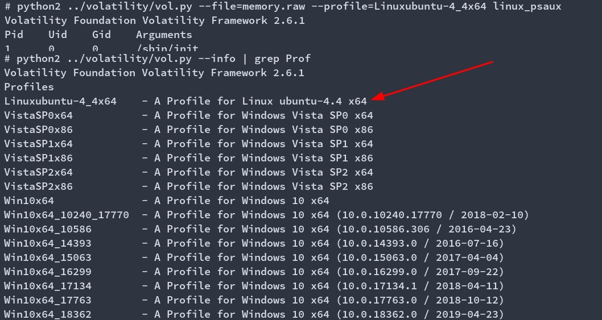
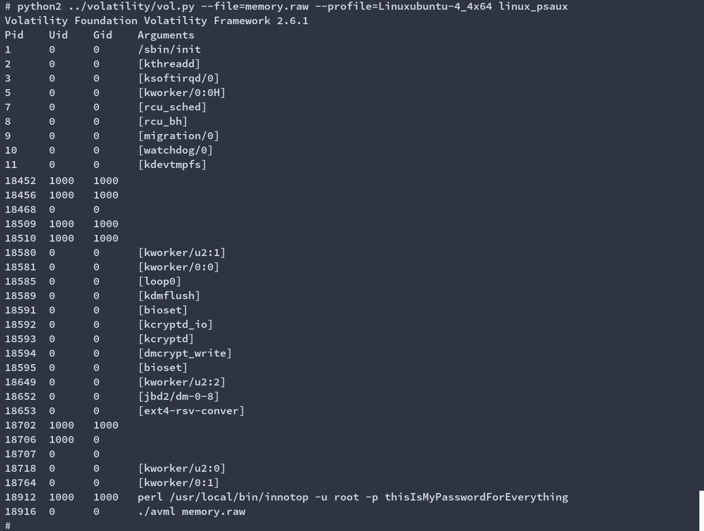
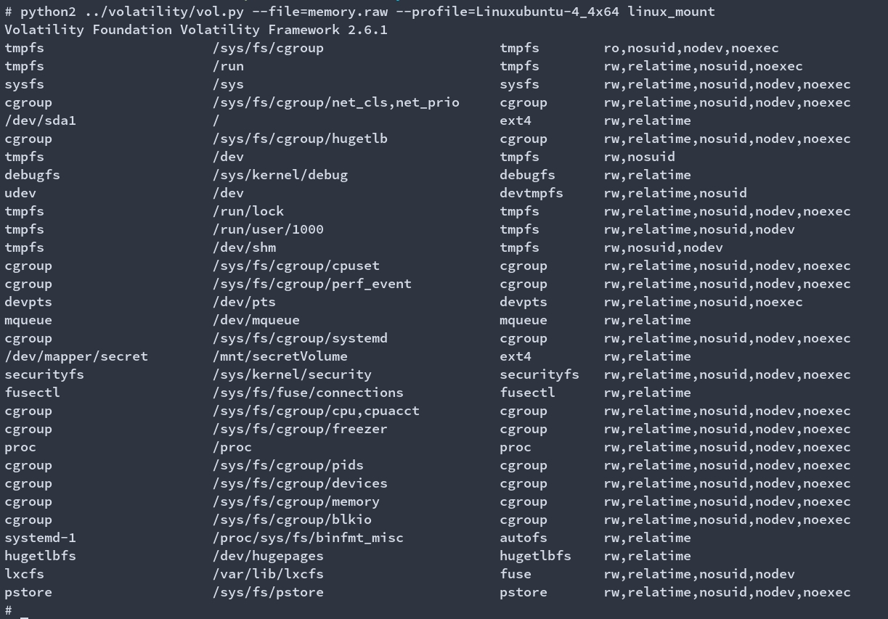

## D5 - Disk & Memory Analysis Challenge

This challenge will have both a memory dump and a disk image. The candidate needs to find both a password and a flag inside a file whose location won't be revealed before hand.

Analyzing the memory dump with volatility (and using the provided profile) the candidate needs to see a process that has a password in the command line.

This is the first flag: `YSH{thisIsMyPasswordForEverything}`

After seeing the password, the candidate should also see an encrypted volume in any of the following manners:

1. Running a "mount" command on the memory image and seeing the mounted volume
1. Seeing the volume in both /etc/fstab or /etc/crypttab
1. Finding the /etc/secret.iso volume
1. Attaching the provided disk to a VM and running it (during the boot up process the machine should ask for a password for the encrypted secret)

You can also decrypt the volume with `cryptsetup luksOpen etc/secret.iso secret` and then mount it using `mount -oro /dev/mapper/secret /mnt/`.

Once the volume is attached, on the inside there will be a `flag.txt` file with the flag.
Flag will be `YSH{58147357c180b3b30dd3e5197b9be057}`
